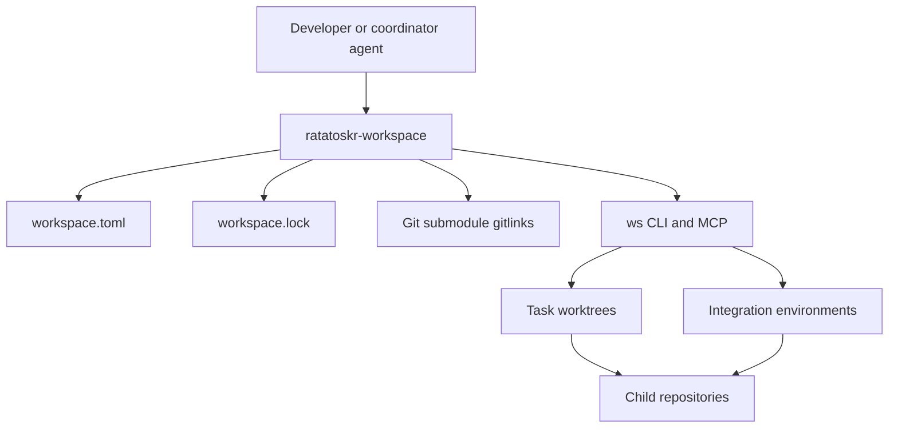
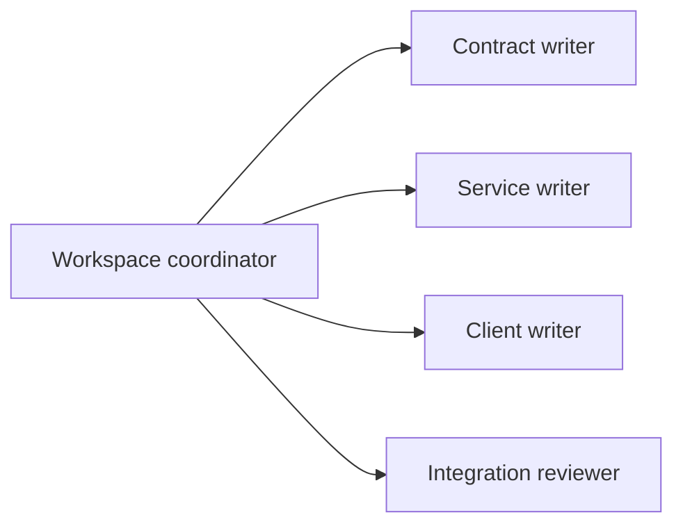

# Ratatoskr Workspace Architecture

> Status: target architecture and operating model. The repository is still in architecture bootstrap; described components become authoritative only as they are implemented and validated.

## 1. Purpose

`ratatoskr-workspace` is the coordination repository for the Ratatoskr multi-repository system. It provides monorepo-like visibility and integration without moving every bounded context into one Git history.

The workspace has five responsibilities:

1. Pin a reproducible, mutually compatible set of child repository commits.
2. Describe repository topology, dependencies, contracts, build commands, and deployment profiles.
3. Create isolated task worktrees for cross-repository development.
4. Coordinate Claude Code, Codex, and future coding agents without allowing them to damage Git topology.
5. Validate and release complete system snapshots.

It does not own runtime domain data, provider credentials, or application business logic.

## 2. Architectural position



The workspace is a Git superproject. Child repositories remain independently cloneable, buildable, testable, releasable, and auditable.

## 3. Sources of truth

Three sources describe a workspace snapshot.

### 3.1. Gitlinks and `.gitmodules`

Git submodule entries pin exact child commit SHAs. They answer:

> Which exact revisions form this Ratatoskr snapshot?

Pinned submodule directories under `repos/` are baseline materializations. They are not normal development worktrees.

### 3.2. `workspace.toml`

The semantic manifest describes:

- repository IDs and paths;
- remotes and default branches;
- repository kinds;
- dependency edges;
- commands for bootstrap, format, lint, test, build, and integration;
- produced and consumed contracts;
- deployment profiles;
- ownership and security classification.

Commit SHAs do not belong in this manifest.

### 3.3. `workspace.lock`

The generated lock records the resolved snapshot, including:

- child commit SHA;
- remote and branch metadata;
- contract and generated-client digests;
- schema versions;
- image or artifact identifiers when available.

The lock is generated by the harness and must not be edited manually.

## 4. Repository layout

```text
ratatoskr-workspace/
├── repos/
│   ├── contracts/
│   ├── platform/
│   ├── extractor/
│   ├── knowledge/
│   ├── github/
│   ├── vault/
│   ├── social/
│   │   ├── x/
│   │   ├── instagram/
│   │   └── threads/
│   ├── ai-archive/
│   │   ├── chatgpt/
│   │   └── claude/
│   ├── integrations/
│   │   └── telegram/
│   ├── clients/
│   │   ├── web/
│   │   ├── mobile/
│   │   ├── browser-extension/
│   │   └── export-agent/
│   └── legacy/
│       └── ratatoskr/
├── harness/
├── agent-kit/
├── changesets/
├── integration/
├── deploy/
├── docs/
├── .agents/
├── .claude/
├── .codex/
├── .gitmodules
├── workspace.toml
├── workspace.lock
├── AGENTS.md
└── README.md
```

The exact layout may evolve, but repository IDs and dependency semantics must remain stable or be migrated explicitly.

## 5. Workspace harness

The harness is implemented as a Rust workspace and exposes the `ws` command plus an optional MCP server.

```text
harness/
├── Cargo.toml
└── crates/
    ├── workspace-core/
    ├── workspace-cli/
    ├── workspace-mcp/
    ├── workspace-git/
    ├── workspace-github/
    ├── workspace-compose/
    ├── workspace-contracts/
    └── agent-runner/
```

### 5.1. Core responsibilities

The harness:

- parses and validates `workspace.toml`;
- inspects gitlinks and repository drift;
- creates and removes task worktrees;
- maintains task and changeset state;
- invokes repository-local commands;
- calculates contract impact;
- generates integration overrides;
- launches agent backends in constrained directories;
- verifies child PR and release state;
- updates `workspace.lock` and submodule pins.

It must use the system Git CLI for submodule and worktree semantics rather than reimplementing Git behavior.

### 5.2. Command model

Representative commands:

```text
ws bootstrap
ws doctor
ws status
ws sync
ws drift
ws graph

ws task new <id>
ws task prepare <id>
ws task verify <id>
ws task clean <id>

ws agent plan <id> --engine <engine>
ws agent run <id> --repo <repo> --engine <engine>
ws agent review <id> --engine <engine>

ws env up <id> --profile <profile>
ws env test <id>
ws env down <id>

ws pr create <id>
ws pr status <id>
ws lock check
ws lock update
ws release snapshot
```

Commands that mutate Git, open PRs, or update pins require an explicit task or changeset ID.

## 6. Task worktrees

Pinned submodules are read-only baselines. Development happens in task-specific worktrees.

```text
.workspaces/
└── RTK-142/
    ├── task.yaml
    ├── context.md
    ├── results/
    └── repos/
        ├── contracts/
        ├── x/
        ├── knowledge/
        └── web/
```

The harness creates a branch and worktree from the relevant upstream branch for each affected repository.

### 6.1. Ownership rule

Within one task:

```text
one repository -> one writer agent
```

Multiple read-only reviewers are allowed. Independent writers require separate branches and worktrees followed by an explicit merge or cherry-pick step.

### 6.2. Isolation

A task worktree receives:

- the task goal;
- affected contracts and dependency edges;
- allowed repository and paths;
- expected checks;
- rollout and compatibility constraints;
- no provider secrets unless the task explicitly requires an approved test credential path.

## 7. Cross-repository changesets

Git cannot create one atomic commit across repositories. A changeset models the coordinated change.

```yaml
id: RTK-142
title: Add authoritative X bookmark synchronization
status: implementing
repositories:
  contracts:
    role: contract-owner
  x:
    role: producer
    depends_on: [contracts]
  knowledge:
    role: consumer
    depends_on: [contracts]
  web:
    role: client
    depends_on: [contracts, knowledge]
compatibility:
  strategy: expand-migrate-contract
  breaking_changes_allowed: false
rollout: [contracts, knowledge, x, web]
rollback: [web, x, knowledge]
```

Supported lifecycle:

```text
draft
-> planned
-> workspaces_ready
-> implementing
-> validating
-> prs_open
-> merged
-> pinned
-> released
-> closed
```

A changeset is the coordination record, not a replacement for child repository PRs.

## 8. Contract rollout

Contract changes follow expand, migrate, contract:

1. Add a backward-compatible contract version or optional field.
2. Update consumers to accept old and new forms.
3. Update producers to emit the new form.
4. Validate integration and replay behavior.
5. Remove the old form only in a later coordinated change.

The workspace owns impact analysis and rollout ordering; `ratatoskr-contracts` owns the wire definitions.

## 9. Agent architecture

### 9.1. Neutral configuration

`agent-kit/` is the neutral source for policies, roles, skills, and hooks. Generated integrations are written to:

```text
.agents/
.claude/
.codex/
```

Generated files must be reproducible and checked for drift.

### 9.2. Coordinator and workers

The root agent acts as a read-only coordinator. Repository implementation agents start inside the assigned task worktree so repository-local `AGENTS.md` instructions apply.



The harness, not the model, owns:

- branch creation;
- worktree placement;
- repository assignment;
- validation command selection;
- PR coordination;
- pin updates;
- release state.

### 9.3. MCP boundary

The workspace MCP server exposes repository topology, task context, dependency graphs, checks, and status. It is read-only by default. Mutating tools require a task ID and explicit authorization.

## 10. Integration environments

The workspace owns cross-service test environments.

```text
integration/
├── compose/
│   ├── base.yaml
│   ├── core.yaml
│   ├── git.yaml
│   ├── social.yaml
│   ├── ai-archive.yaml
│   ├── telegram.yaml
│   └── full.yaml
├── fixtures/
└── tests/
```

For a task, the harness generates Compose overrides pointing affected services to task worktrees. Each task receives isolated project names, database namespaces, NATS streams, bucket prefixes, ports, and volumes.

## 11. CI architecture

### 11.1. Child CI

Each child repository remains independently buildable and owns its format, lint, unit, integration, security, and packaging checks.

### 11.2. Workspace CI

Workspace CI validates:

- `workspace.toml` against `.gitmodules`;
- existence and reachability of pinned commits;
- `workspace.lock` freshness;
- dependency graph acyclicity;
- contract compatibility and generated-client drift;
- integration profiles;
- changeset-to-PR consistency;
- generated agent configuration;
- release snapshot integrity.

Workspace CI must not replace repository-local CI.

## 12. Release model

```text
child main       = latest valid component revision
workspace main   = latest validated compatible system snapshot
workspace tag    = immutable release/deployment snapshot
```

A release snapshot is produced only after:

1. Child PRs merge in dependency order.
2. Submodule pins are updated to merged SHAs.
3. `workspace.lock` is regenerated.
4. Required integration profiles pass.
5. Rollback information is recorded.
6. The workspace snapshot PR merges.

Tags use a deterministic convention such as `workspace-YYYY.MM.DD.N` until semantic product versioning is introduced.

## 13. Security and safety boundaries

- Baseline submodules are never edited directly.
- Secrets never enter manifests, lockfiles, task context, agent prompts, logs, or fixtures.
- Destructive Git commands, force pushes, branch deletion, and cleanup require explicit harness operations.
- Agents do not merge PRs or update release pins outside the approved workflow.
- Private repository access uses short-lived installation credentials or constrained deploy credentials.
- Task environments must not share production volumes or provider tokens.
- Generated integration configuration is reviewed like source code.

## 14. Failure model

The workspace must remain useful when individual repositories or tools are unavailable.

- Failed repository fetches are reported per repository without silently changing pins.
- A partially prepared task is resumable.
- Worktree creation and cleanup are idempotent.
- Integration environments are namespaced and recoverable after interruption.
- A failed release never advances workspace pins on `main`.
- Agent failure preserves task logs and changed-file state for manual recovery.

## 15. Observability

The harness emits structured records for:

- command duration and result;
- repository and branch operations;
- task lifecycle transitions;
- agent engine and assigned repository;
- checks executed and their outcomes;
- environment lifecycle;
- PR and merge status;
- lock and pin drift.

Logs must not include file contents, prompts containing secrets, access tokens, or provider exports.

## 16. Architectural invariants

1. Child repositories remain independently buildable.
2. Gitlinks, manifest, and lock describe different aspects of one snapshot and must agree.
3. Pinned submodules are baselines, not development worktrees.
4. Every cross-repository change has a changeset ID.
5. One repository has at most one writer per task.
6. Contract changes use expand, migrate, contract.
7. Workspace `main` always represents a validated compatible snapshot.
8. Agents modify code only in assigned task worktrees.
9. The harness owns Git topology and release coordination.
10. Runtime domain data and provider credentials never belong in this repository.

## 17. Evolution

Initial implementation should proceed in vertical increments:

1. Parse manifest and report status/drift.
2. Materialize current repositories as submodules.
3. Create task worktrees and verify repository-local commands.
4. Run Claude Code and Codex in one assigned repository each.
5. Coordinate one real cross-repository contract change.
6. Add integration profiles and lock generation.
7. Add PR coordination and release snapshot automation.
8. Add read-only MCP resources before mutating MCP tools.

Changes to the workspace operating model should be captured in ADRs under `docs/decisions/` and reflected in `AGENTS.md` when they affect coding-agent behavior.
